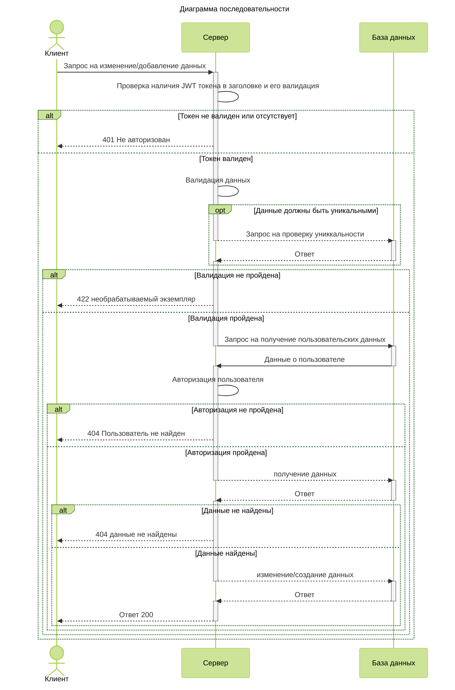
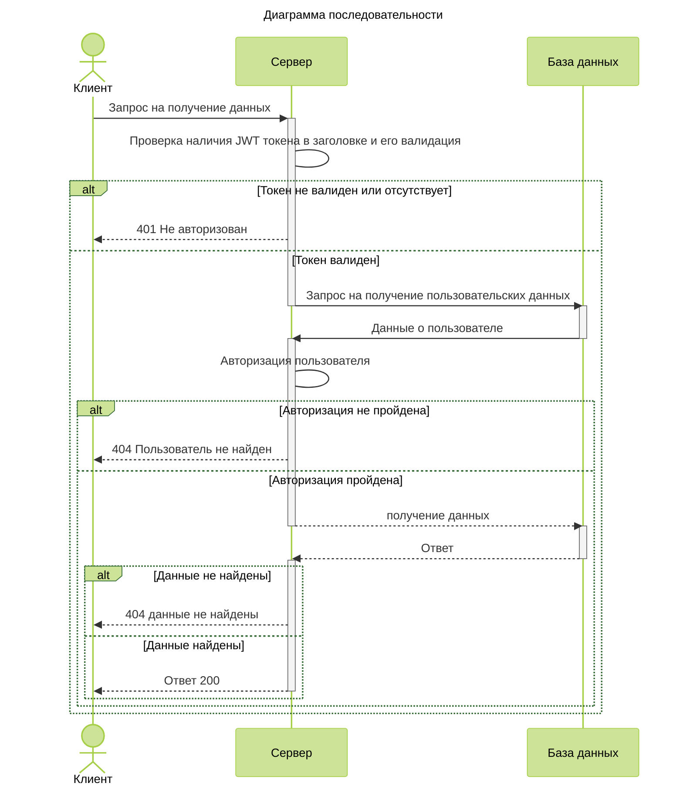
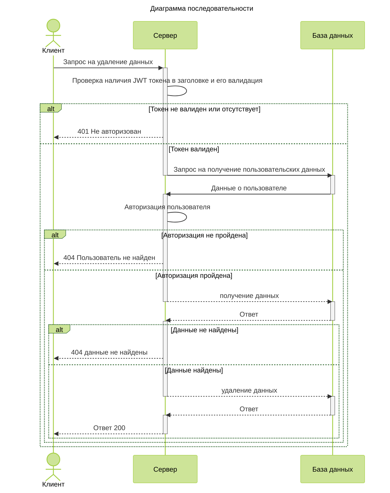
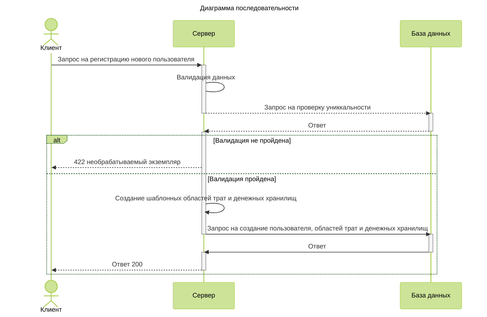

# SmartWallet
## Диаграммы последовательности
### Добавление и обновление данных
Взаимодействия клиента, сервера и базы данных при запросе на добавление/обновление данных

### Получение данных
Взаимодействия клиента, сервера и базы данных при запросе данных:

### Удаление данных
Взаимодействия клиента, сервера и базы данных при запросе на удаление данных:

### Регистрация нового пользователя
Взаимодействия клиента, сервера и базы данных при запросе на регистрацию пользователя:

