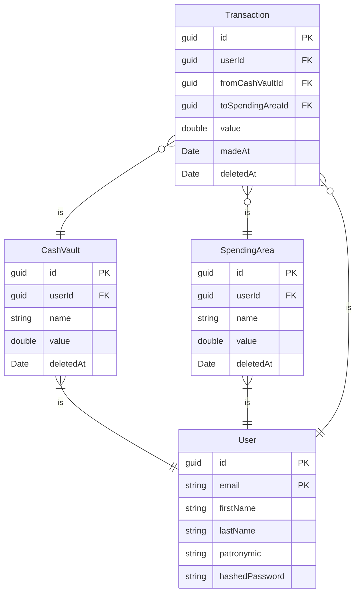

# SmartWallet
## Диаграмма базы данных

## Диаграмма последовательности взаимодействия клиента и сервера
```mermaid
sequenceDiagram
  
```
## Возможные улучшения
 - Добать под области трат, которые находятся в областях трат, а также могут иметь в себе свои под области. Возможно для хранения под областей стоит использовать графовую БД 
 - Добавить интеграцию с банками