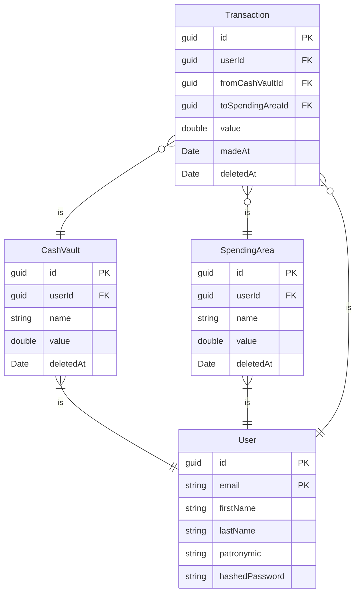

# SmartWallet
## Диаграмма базы данных

## Структура программы
# Структура проекта SmartWallet
```bash
    ├── .gitattributes
    ├── .gitignore
    ├── README.md
    ├── SmartWallet.sln

    ├── .github
    │ └── workflows

    ├── Common
    │ ├── Common.Infrastructure
    │ │ ├── ApiIdentityProvider.cs
    │ │ └── Common.Infrastructure.csproj
    │ │
    │ └── Common.Infrastructure.Contracts
    │ ├── Common.Infrastructure.Contracts.csproj
    │ └── IIdentityProvider.cs

    ├── DAL
    │ ├── Context
    │ │ ├── Context.csproj
    │ │ └── SmartWalletContext.cs
    │ │
    │ ├── Context.Contracts
    │ │ ├── Context.Contracts.csproj
    │ │ └── IDataStorageContext.cs
    │ │
    │ ├── Context.Repository
    │ │ ├── BaseWriteRepository.cs
    │ │ ├── CashVaultRepository.cs
    │ │ ├── Context.Repository.csproj
    │ │ ├── SpendingAreaRepository.cs
    │ │ ├── TransactionRepository.cs
    │ │ ├── UnitOfWork.cs
    │ │ └── UserRepository.cs
    │ │
    │ ├── Context.Repository.Contracts
    │ │ ├── Context.Repository.Contracts.csproj
    │ │ ├── IBaseWriteRepository.cs
    │ │ ├── ICashVaultRepository.cs
    │ │ ├── ISpendingAreaRepository.cs
    │ │ ├── ITransactionRepository.cs
    │ │ ├── IUnitOfWork.cs
    │ │ └── IUserRepository.cs
    │ │
    │ ├── Entities
    │ │ ├── BaseEntity.cs
    │ │ ├── CashVault.cs
    │ │ ├── Entities.csproj
    │ │ ├── SmartDeletedEntity.cs
    │ │ ├── SpendingArea.cs
    │ │ ├── Transaction.cs
    │ │ ├── User.cs
    │ │ │
    │ │ └── Contracts
    │ │ ├── IBaseEntity.cs
    │ │ └── ISmartDeletedEntity.cs
    │ │
    │ └── Entity.Configuration
    │ ├── CashVaultConfiguration.cs
    │ ├── Entity.Configuration.csproj
    │ ├── SmartWalletAnchorEntity.cs
    │ ├── SpendingAreaConfiguration.cs
    │ ├── TransactionConfiguration.cs
    │ └── UserConfiguration.cs

    ├── Documentation
    │ ├── Курсовая задача начинка.docx
    │ ├── Курсовой проект титульник.docx
    │ ├── Отзыв.docx
    │ ├── Техническое задание.docx
    │ ├── Титульник курсовой задачи.docx
    │ ├── Титульник пояснительной записки.docx
    │ ├── Титульник ТЗ.docx
    │ │
    │ └── Diagrams
    │ └── Диаграмма последовательности.md

    ├── Service.Exceptions
    │ ├── AuthorizationServiceException.cs
    │ ├── EntityAccessServiceException.cs
    │ ├── EntityNotFoundServiceExeption.cs
    │ ├── EntityServiceException.cs
    │ ├── InvalidOperationSmartWalletEntityServiceException.cs
    │ ├── Service.Exceptions.csproj
    │ ├── ServiceException.cs
    │ └── SmartWalletValidationException.cs

    ├── Service.Infrastructure.Contracts
    │ ├── IJwtProvider.cs
    │ ├── IPasswordHasher.cs
    │ └── Service.Infrastructure.Contracts.csproj

    ├── Service.Models
    │ ├── Service.Models.csproj
    │ │
    │ ├── CreateModels
    │ │ ├── CreateCashVaultModel.cs
    │ │ ├── CreateSpendingAreaModel.cs
    │ │ ├── CreateTransactionModel.cs
    │ │ └── CreateUserModel.cs
    │ │
    │ ├── DeleteModels
    │ │ ├── DeleteCashVaultModel.cs
    │ │ ├── DeleteSpendingAreaModel.cs
    │ │ ├── DeleteTransactionModel.cs
    │ │ └── DeleteUserModel.cs
    │ │
    │ ├── Models
    │ │ ├── CashVaultModel.cs
    │ │ ├── LogInModel.cs
    │ │ ├── SpendingAreaModel.cs
    │ │ ├── TransactionModel.cs
    │ │ └── UserModel.cs
    │ │
    │ └── UpdateModels
    │ ├── UpdateCashVaultModel.cs
    │ ├── UpdateSpendingAreaModel.cs
    │ └── UpdateUserModel.cs

    ├── Services
    │ ├── CashVaultService.cs
    │ ├── FinancialAnalyticsService.cs
    │ ├── Services.csproj
    │ ├── SpendingAreaService.cs
    │ ├── TransactionService.cs
    │ └── UserService.cs
    │ │
    │ ├── AutoMappers
    │ │ └── ServiceModelMapper.cs
    │ │
    │ └── Validators
    │ ├── SmartWalletValidateService.cs
    │ │
    │ ├── CreateModelValidators
    │ │ ├── CreateCashVaultModelValidator.cs
    │ │ ├── CreateSpendingAreaModelValidator.cs
    │ │ ├── CreateTransactionModelValidator.cs
    │ │ └── CreateUserModelValidator.cs
    │ │
    │ ├── CustomRules
    │ │ └── StringRules.cs
    │ │
    │ ├── DeleteModelValidators
    │ │ ├── DeleteCashVaultModelValidator.cs
    │ │ ├── DeleteSpendingAreaModelValidator.cs
    │ │ ├── DeleteTransactionModelValidator.cs
    │ │ └── DeleteUserModelValidator.cs
    │ │
    │ ├── ModelValidators
    │ │ ├── LogInModelValidator.cs
    │ │ └── UserModelValidator.cs
    │ │
    │ └── UpdateModelValidators
    │ ├── UpdateCashVaultModelValidator.cs
    │ ├── UpdateSpendingAreaModelValidator.cs
    │ └── UpdateUserModelValidator.cs

    ├── Services.Contracts
    │ ├── ICashVaultService.cs
    │ ├── IFinancialAnalyticsService.cs
    │ ├── ISmartWalletValidateService.cs
    │ ├── ISpendingAreaService.cs
    │ ├── ITransactionService.cs
    │ ├── IUserService.cs
    │ └── Services.Contracts.csproj

    ├── Services.Infrastructure
    │ ├── JwtProvider.cs
    │ ├── PasswordHasher.cs
    │ └── Service.Infrastructure.csproj

    ├── SmartWallet
    │ ├── appsettings.Development.json
    │ ├── appsettings.json
    │ ├── Program.cs
    │ ├── SmartWallet.csproj
    │ └── SmartWallet.http
    │ │
    │ ├── AutoMappers
    │ │ └── ApiModelMapper.cs
    │ │
    │ ├── Controllers
    │ │ ├── CashVaultController.cs
    │ │ ├── FinancialAnalyticsController.cs
    │ │ ├── SpendingAreaController.cs
    │ │ ├── TransactionController.cs
    │ │ └── UserController.cs
    │ │
    │ ├── Infrastructure
    │ │ ├── ApiExceptionDetails.cs
    │ │ └── SmartWalletExceptionFilter.cs
    │ │
    │ ├── Models
    │ │ ├── Account
    │ │ │ ├── CreateUserApiModel.cs
    │ │ │ ├── DeleteUserApiModel.cs
    │ │ │ ├── RequestLogInApiModel.cs
    │ │ │ ├── ResponseLogInApiModel.cs
    │ │ │ ├── UpdateUserApiModel.cs
    │ │ │ └── UserApiModel.cs
    │ │ │
    │ │ ├── CashVault
    │ │ │ ├── CashVaultApiModel.cs
    │ │ │ ├── CreateCashVaultApiModel.cs
    │ │ │ ├── DeleteCashVaultApiModel.cs
    │ │ │ └── UpdateCashVaultApiModel.cs
    │ │ │
    │ │ ├── FinancialAnalytics
    │ │ │ ├── CategorizingSpendingApiRequest.cs
    │ │ │ └── CategorizingSpendingApiResponse.cs
    │ │ │
    │ │ ├── SpendingArea
    │ │ │ ├── CreateSpendingAreaApiModel.cs
    │ │ │ ├── DeleteSpendingAreaApiModel.cs
    │ │ │ ├── SpendingAreaApiModel.cs
    │ │ │ └── UpdateSpendingAreaApiModel.cs
    │ │ │
    │ │ └── Transaction
    │ │ ├── CreateTransactionApiModel.cs
    │ │ ├── DeleteTransactionApiModel.cs
    │ │ └── TransactionApiModel.cs
    │ │
    │ └── Properties
    │ └── launchSettings.json

    └── SmartWallet.Options
    ├── JwtOptions.cs
    └── SmartWallet.Options.csproj
```
## Возможные улучшения
 - Добать под области трат, которые находятся в областях трат, а также могут иметь в себе свои под области. В таблице SpendingArea будут хранится как обычные узлы дерева области трат, так и листья дерева, которые можно будет отличить по установленому флагу isLeaf. Для хранения структуры дерева стоит использовать графовую БД. Удалить обычный узел будет нельзя
 - Добавить интеграцию с банками
 - Добавить возможность восстанавливать транзакции и области трат после их удаления
 - Обнулять значение областей трат 1-го числа каждого месяца
 - Создать механизм "заработной платы". Каждый месяц в указанную дату на указанное пользователем денежное хранилище поступают деньги
 - Поддержка нескольких валют