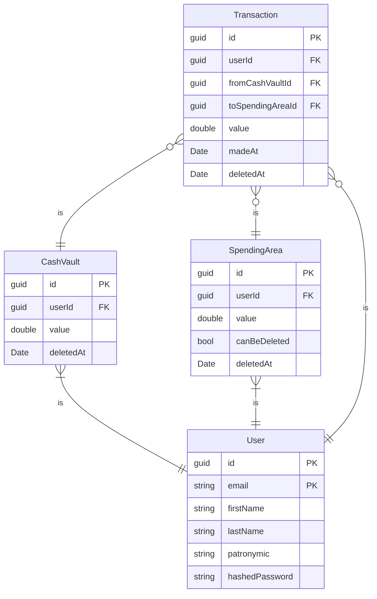

# SmartWallet
## Диаграмма базы данных

```mermaid
erDiagram
    CashVault }|--|| User : is
    CashVault {
        guid id PK
        guid userId FK
        double value
        Date deletedAt
    }

    SpendingArea }|--|| User : is
    SpendingArea{
        guid id PK
        guid userId FK
        double value
        bool canBeDeleted
        Date deletedAt
    }

    Transaction }o--|| User : is
    Transaction }o--|| CashVault : is
    Transaction }o--|| SpendingArea : is
    Transaction {
        guid id PK
        guid userId FK
        guid fromCashVaultId FK
        guid toSpendingAreaId FK
        double value
        Date madeAt
        Date deletedAt
    }

    User {
        guid id PK
        string email PK
        string firstName
        string lastName
        string patronymic
        string hashedPassword
    }
```
## Диаграмма последовательности взаимодействия клиента и сервера
```mermaid
sequenceDiagram
  
```