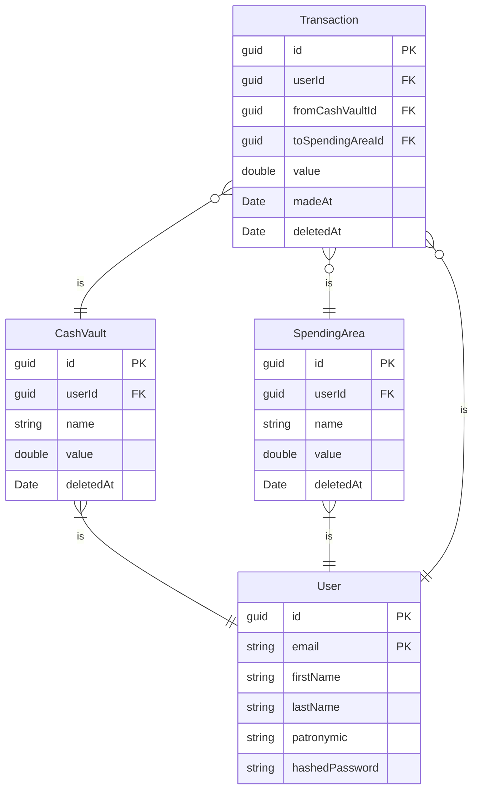

# SmartWallet
## Описание

---
SmartWallet - Web API для отслеживания и анализа трат.
## Требования

---
.net 8.0 SDK https://dotnet.microsoft.com/en-us/download/dotnet/8.0
## Диаграмма базы данных

---

## Возможные улучшения

---
 - Добавить под области трат, которые находятся в областях трат, а также могут иметь в себе свои под области. В таблице SpendingArea будут храниться как обычные узлы дерева области трат, так и листья дерева, которые можно будет отличить по установленному флагу `isLeaf`. Для хранения структуры дерева стоит использовать графовую БД. Можно будет удалить только узел с флагом `isLeaf`;
 - Добавить интеграцию с банками;
 - Добавить возможность восстанавливать транзакции и области трат после их удаления;
 - Обнулять значение областей трат 1-го числа каждого месяца;
 - Создать механизм "заработной платы". Каждый месяц в указанную дату на указанное пользователем денежное хранилище поступают деньги;
 - Поддержка нескольких валют.