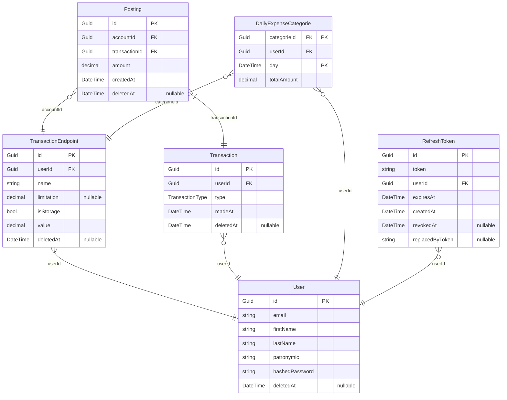

# SmartWallet
## Описание
SmartWallet - Web API для отслеживания и анализа трат.
## Требования
.net 8.0 SDK https://dotnet.microsoft.com/en-us/download/dotnet/8.0
## Развёртыввание в Docker

### Архитектура

```
Browser ──HTTPS──► smartwallet-nginx (443)
                       ├── /api/* ──HTTP──► smartwallet-api:80
                       └── /*      ──HTTP──► smartwallet-client:8080
Browser ──HTTP───► smartwallet-nginx (80) ──redirect──► HTTPS (443)
```

- Внешний nginx обрабатывает SSL-терминацию, заголовки безопасности и поддержку WebSocket
- Внутренний трафик между контейнерами передаётся по HTTP (безопасно внутри docker-сети)
- API доступен извне только по HTTPS (порт 8443 для прямого доступа, или через nginx на порту 443)

### Сервисы в docker-compose.yml

| Сервис | Образ | Внешние порты | Назначение |
|--------|-------|---------------|------------|
| smartwallet-db | postgres:16-alpine | 5435:5432 | Основная база данных |
| smartwallet-hangfire-db | postgres:16-alpine | 5440:5432 | База данных Hangfire (фоновые задачи) |
| smartwallet-migrations | nasurino/smart-wallet:latest | — | Выполняет миграции БД, затем завершается |
| smartwallet-api | nasurino/smart-wallet:latest | 8443:443 | Бэкенд API (только HTTPS) |
| smartwallet-client | nasurino/smart-wallet-client:latest | — | Фронтенд SPA (статический режим) |
| smartwallet-nginx | nginx:1.27-alpine | 80:80, 443:443 | Обратный прокси + SSL-терминация |

### Предварительные требования

- Docker и Docker Compose
- Образы Docker Hub: `nasurino/smart-wallet:latest` и `nasurino/smart-wallet-client:latest`

### Быстрый старт

1. Сгенерируйте SSL-сертификаты:
```bash
chmod +x generate-certs.sh
./generate-certs.sh
```

2. Запустите все сервисы:
```bash
docker compose up -d
```

3. Проверьте работоспособность:
```bash
# Убедитесь, что все контейнеры запущены/healthy
docker compose ps

# Проверьте фронтенд
curl -k https://localhost/

# Проверьте API через nginx
curl -k https://localhost/api/users/me

# Проверьте API напрямую (HTTPS)
curl -k https://localhost:8443/health

# Проверьте редирект HTTP→HTTPS
curl -I http://localhost/
```

4. Откройте в браузере: `https://localhost/` (примите предупреждение о самоподписанном сертификате)

### Остановка

```bash
docker compose down
# С удалением томов:
docker compose down -v
```

### SSL-сертификаты

Самоподписанные сертификаты генерируются скриптом `generate-certs.sh` в директорию `certs/nginx/`. Скрипт идемпотентен — повторный запуск пропустит генерацию, если сертификаты уже существуют.

Для продакшена замените `certs/nginx/server.crt` и `certs/nginx/server.key` на настоящие сертификаты от центра сертификации (например, Let's Encrypt).

### Конфигурация

#### Переменные окружения (docker-compose.yml)

Ключевые переменные в `smartwallet-api`:
- `ASPNETCORE_ENVIRONMENT: Production`
- `ConnectionStrings__SmartWalletConnectionString` — подключение к PostgreSQL
- `ConnectionStrings__HangfireConnection` — подключение к Hangfire PostgreSQL

Ключевые переменные в `smartwallet-client`:
- `API_BASE_URL: ""` — пустая строка (статический режим, nginx обрабатывает маршрутизацию)

#### Порты

| Порт | Сервис | Протокол | Назначение |
|------|--------|----------|------------|
| 80 | nginx | HTTP | Редирект на HTTPS |
| 443 | nginx | HTTPS | Основная точка входа (фронтенд + API) |
| 5435 | PostgreSQL | — | Основная БД (доступ для разработки) |
| 5440 | PostgreSQL | — | БД Hangfire (доступ для разработки) |
| 8443 | API | HTTPS | Прямой доступ к API (для сторонних клиентов) |

#### Порядок запуска

```
smartwallet-db (healthy)
  └─> smartwallet-migrations (completed)
        └─> smartwallet-api (healthy)
              ├─> smartwallet-client (healthy)
              └──────────────────────────────┐
              └─> smartwallet-nginx          │
                    (depends on both above)  │
```

### Устранение неполадок

- **Контейнер unhealthy**: проверьте `docker compose ps` и `docker compose logs <сервис>`
- **Ошибки сертификатов**: убедитесь, что в `certs/nginx/` есть `server.crt` и `server.key`
- **API не отвечает через nginx**: сначала проверьте, что `smartwallet-api` healthy
- **Фронтенд показывает пустую страницу**: проверьте логи `smartwallet-client`, убедитесь что `API_BASE_URL` пустая строка
## Диаграмма базы данных

```mermaid
erDiagram
    TransactionEndpoint }|--|| User : userId
    TransactionEndpoint {
        Guid id PK
        Guid userId FK
        string name
        decimal limitation "nullable"
        bool isStorage
        decimal value
        DateTime deletedAt "nullable"
    }

    Transaction }o--|| User : userId
    Transaction {
        Guid id PK
        Guid userId FK
        TransactionType type
        DateTime madeAt
        DateTime deletedAt "nullable"
    }

    Posting }o--|| TransactionEndpoint : accountId
    Posting }|--|| Transaction : transactionId
    Posting {
        Guid id PK
        Guid accountId FK
        Guid transactionId FK
        decimal amount
        DateTime createdAt
        DateTime deletedAt "nullable"
    }

    DailyExpenseCategorie }o--|| TransactionEndpoint : categorieId
    DailyExpenseCategorie }o--|| User : userId
    DailyExpenseCategorie {
        Guid categorieId FK "PK"
        Guid userId FK
        DateTime day "PK"
        decimal totalAmount
    }

    User {
        Guid id PK
        string email
        string firstName
        string lastName
        string patronymic
        string hashedPassword
        DateTime deletedAt "nullable"
    }

    RefreshToken }o--|| User : userId
    RefreshToken {
        Guid id PK
        string token
        Guid userId FK
        DateTime expiresAt
        DateTime createdAt
        DateTime revokedAt "nullable"
        string replacedByToken "nullable"
    }
```
## Возможные улучшения
 - Добавить под области трат, которые находятся в областях трат, а также могут иметь в себе свои под области;
 - Добавить интеграцию с банками;
 - Добавить возможность восстанавливать транзакции и области трат после их удаления;
 - Создать механизм "заработной платы". Каждый месяц в указанную дату на указанное пользователем денежное хранилище поступают деньги;
 - Поддержка нескольких валют.
