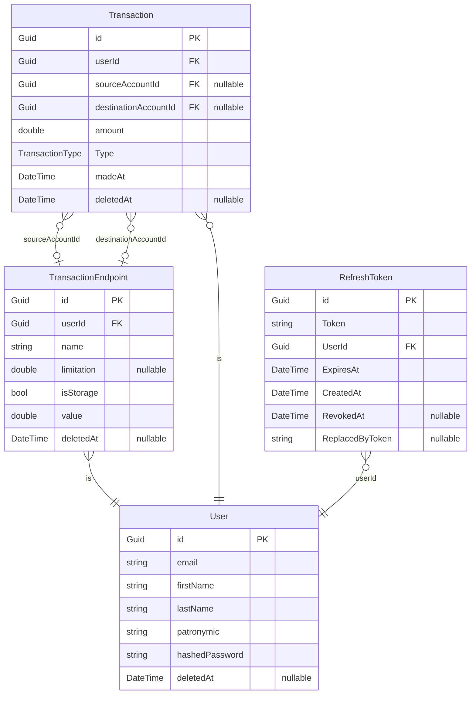

# SmartWallet
## Описание
SmartWallet - Web API для отслеживания и анализа личных финансов.
## Требования
- [.net 8.0 SDK](https://dotnet.microsoft.com/en-us/download/dotnet/8.0)
- [Docker](https://www.docker.com/get-started/)

## Возможности

- Авторизация пользователя с JWT
- CRUD для Эндпоинтов транзакций
- Создание/удаление транзакций между эндпоинтами
- Аналитика транзакций:
  - Траты по эндпоинтам за временной диапазон
  - Сравнительный анализ трат по эндпоинтам за выбранные временные диапазоны
  - Траты по эндпоинтам за временной диапазон, агрегированные по дням, месяцам и годам

## Технический стек
- C# 12
- .Net 8
- ASP.NET Core 8
- EF Core 8
- PostgreSQL
- FluentValidation 11.11
- BCrypt.Net-Next 4.0
- AutoMapper 14.0
- FluentAssertions 8.5
- XUnit 2.9
- Moq 4.20
- Hangfire.Core 1.8

## Структура проекта
```text
Directory.Packages.props        #Версии зависимостей проекта
SmartWallet/
        Program.cs              #Вход в программу
        Controllers/            #Эндпоинты Api
        appsettings.json        #Настройки приложения
Services/                       #Сервисы с основной логикой api
        Validators/             #Валидаторы моделей
        BackgroundService/      #Сервисы для фоновых задач
Service.Tests/                  #Тесты для сервисов
DAL/
        Context/                #Контекст бд для EFCore
        Context.Repository/     #Репозитории
        Context.Tests/          #База на памяти для тестирования
        Entities/               #Модели сущностей бд
        Entity.Configuration/   #Классы для конфигурации моделей сущностей бд
scripts/                        #Скрипт для заполнения бд транзакциями
```

## Быстрый старт

### 1. Быстрый старт через Docker (полный стек)

Развёртывание всех сервисов: фронтенд, бэкенд API, базы данных, миграции и nginx с SSL.

#### Предварительные требования

- [Docker](https://docs.docker.com/get-docker/) и [Docker Compose](https://docs.docker.com/compose/install/) (v2+)
- Образы Docker Hub: `nasurino/smart-wallet:latest` и `nasurino/smart-wallet-client:latest`

#### Пошаговая инструкция

##### 1. Клонировать репозиторий

```bash
git clone https://github.com/Pipotka/SmartWallet
cd SmartWallet
```

##### 2. Настроить переменные окружения

Создайте файл `.env` в корне проекта:

```env
# Основная база данных (SmartWalletDb)
API_DB_USER=postgres
API_DB_PASSWORD=mysecretpassword

# База данных Hangfire (SmartWalletHangfireDb)
HANGFIRE_DB_USER=postgres
HANGFIRE_DB_PASSWORD=mysecretpassword

# Окружение ASP.NET Core (Production или Development)
API_ENVIRONMENT=Production

# JWT-аутентификация
API_JWT_KEY=ваш-секретный-ключ-минимум-32-символа
API_JWT_EXPIRES_MINUTES=20
API_JWT_REFRESH_EXPIRES_DAYS=7

# BCrypt
API_BCRYPT_WORK_FACTOR=12

# URL API для фронтенда
API_BASE_URL=https://localhost:443
```

> **Важно:** замените `API_JWT_KEY` на уникальный секретный ключ.

Создайте файл `api_allowed_origins.env`, в котором указывается массив разрешённых CORS-источников.

```env
ApiSettings__CqrsSettings__AllowedOrigins__0=https://localhost
```

##### 3. Сгенерировать SSL-сертификаты

```bash
chmod +x generate-certs.sh
./generate-certs.sh
```

Скрипт создаст самоподписанные сертификаты в `certs/nginx/` (server.key и server.crt). Скрипт идемпотентен -- повторный запуск пропустит генерацию, если файлы уже существуют.

##### 4. Собрать и загрузить образы

```bash
# Загрузить готовые образы из Docker Hub
docker compose pull
```

##### 5. Запустить все сервисы

```bash
docker compose up -d
```

Docker Compose автоматически соблюдает порядок зависимостей:

```
smartwallet-db (healthy)
  └─> smartwallet-migrations (completed)
        └─> smartwallet-api (healthy)
              ├─> smartwallet-client (healthy)
              └─────────────────────────────┐
              └─> smartwallet-nginx         │
                    (depends on both above) │
```

##### 6. Проверить работоспособность

> **Примечание для пользователей Windows PowerShell:** далее используется `curl.exe` вместо `curl`. PowerShell сопоставляет `curl` с `Invoke-WebRequest`, который не поддерживает флаги вроде `-k`. Использование `curl.exe` вызывает настоящий curl (поставляется с Windows 10+). На Linux/macOS `curl` и `curl.exe` эквивалентны.

```bash
# Статус всех контейнеров
docker compose ps

# Health check API
curl.exe -k https://localhost/api/health

# Фронтенд
curl.exe -k https://localhost/
```

##### 7. Остановка сервисов

```bash
# Остановить контейнеры, сохранить данные в volumes
docker compose down

# Остановить и удалить все данные (БД, volumes)
docker compose down -v
```

#### Точки доступа

| Ресурс       | URL                            | Описание                           |
| ------------ | ------------------------------ | ---------------------------------- |
| Фронтенд     | `https://localhost`            | SPA через nginx (HTTPS)            |
| API          | `https://localhost/api/`       | API через обратный прокси nginx    |
| Health check | `https://localhost/api/health` | Проверка состояния API через nginx |
| Основная БД  | `localhost:5435`               | PostgreSQL (SmartWalletDb)         |
| БД Hangfire  | `localhost:5440`               | PostgreSQL (SmartWalletHangfireDb) |

> При первом открытии `https://localhost` браузер покажет предупреждение о самоподписанном сертификате -- это нормально для локальной разработки.

#### Устранение неполадок

| Проблема                              | Решение                                                                                                                    |
| ------------------------------------- | -------------------------------------------------------------------------------------------------------------------------- |
| `smartwallet-nginx` не стартует       | Убедитесь, что выполнены `./generate-certs.sh` и файлы `certs/nginx/server.key`, `certs/nginx/server.crt` существуют       |
| Порт 80 или 443 занят                 | Остановите процесс, занимающий порт, или измените маппинг портов в `docker-compose.yml` (секция `smartwallet-nginx.ports`) |
| Порт 5435 или 5440 занят              | Проверьте, не запущен ли локальный PostgreSQL: `sudo lsof -i :5435`                                                        |
| Контейнер `smartwallet-api` unhealthy | Проверьте логи: `docker compose logs smartwallet-api`                                                                      |
| Миграции не применились               | Проверьте логи: `docker compose logs smartwallet-migrations`                                                               |
| Фронтенд показывает пустую страницу   | Проверьте логи: `docker compose logs smartwallet-client`, убедитесь что `API_BASE_URL` в `.env` корректен                  |

---

### 2. Запуск для разработчика бэкенда

Локальный запуск API без Docker -- для активной разработки и отладки.

#### Предварительные требования

- [.NET 8 SDK](https://dotnet.microsoft.com/en-us/download/dotnet/8.0)
- PostgreSQL 16+ (или используйте Docker только для баз данных -- см. ниже)
- EF Core CLI:

```bash
dotnet tool install --global dotnet-ef
```

#### Пошаговая инструкция

##### 1. Клонировать репозиторий

```bash
git clone https://github.com/Pipotka/SmartWallet
cd SmartWallet
```

##### 2. Настроить строки подключения
Настройте строки подключения в `SmartWallet/appsettings.Development.json`:

```json
{
  "ConnectionStrings": {
    "SmartWalletConnectionString": "Host=localhost;Port=5432;Database=SmartWalletDb;Username=postgres;Password=postgres",
    "HangfireConnection": "Host=localhost;Port=5432;Database=SmartWalletHangfireDb;Username=postgres;Password=postgres"
  }
}
```

##### 3. Настроить JWT-ключ и прочие секреты
Настройте секреты в `appsettings.Development.json`:

```json
{
  "ApiSettings": {
    "JwtSettings": {
      "Key": "ваш-секретный-ключ-минимум-32-символа"
    }
  }
}
```

##### 4. Создать базы данных

Подключитесь к PostgreSQL и создайте две базы:

```sql
CREATE DATABASE "SmartWalletDb";
CREATE DATABASE "SmartWalletHangfireDb";
```

##### 5. Применить миграции

**Вариант A -- через EF Core CLI:**

```bash
dotnet ef database update --project DAL\Context\Context.csproj --startup-project SmartWallet\SmartWallet.csproj
```

> EF Core CLI автоматически прочитает строку подключения из конфигурации.

**Вариант B -- через встроенный режим миграций:**

```bash
dotnet run --project SmartWallet\SmartWallet.csproj -- -m "Host=localhost;Port=5432;Database=SmartWalletDb;Username=postgres;Password=postgres"
```

Этот режим применяет миграции и завершает работу приложения.

##### 6. Запустить API

```bash
dotnet run --project SmartWallet\SmartWallet.csproj
```

API запустится в режиме `Development` (по умолчанию из `launchSettings.json`).

##### 7. Проверить работоспособность

```bash
# Health check
curl.exe http://localhost:5079/health

# Swagger UI
# Откройте в браузере: http://localhost:5079/swagger
```

#### Точки доступа при локальной разработке

| Ресурс             | URL                              |
| ------------------ | -------------------------------- |
| API (HTTP)         | `http://localhost:5079`          |
| API (HTTPS)        | `https://localhost:7178`         |
| Swagger UI         | `http://localhost:5079/swagger`  |
| Hangfire Dashboard | `http://localhost:5079/hangfire` |
| Health check       | `http://localhost:5079/health`   |

> Swagger и Hangfire Dashboard доступны только в режиме `Development`.

#### Docker только для баз данных

Если не хотите устанавливать PostgreSQL локально, запустите только контейнеры с БД:

```bash
docker compose up smartwallet-db smartwallet-hangfire-db -d
```

Будут доступны:
- Основная БД: `localhost:5435` (SmartWalletDb)
- БД Hangfire: `localhost:5440` (SmartWalletHangfireDb)

Строка подключения в этом случае:

```
Host=localhost;Port=5435;Database=SmartWalletDb;Username=postgres;Password=mysecretpassword
```

> Порты в Docker отличаются от локальных (5435 вместо 5432) -- учитывайте это в строке подключения.

#### Запуск тестов

```bash
# Все тесты решения
dotnet test SmartWallet.sln

# Тесты конкретного проекта
dotnet test Services/Services.Tests/Services.Tests.csproj
dotnet test AutoMapper.Tests/AutoMapper.Tests.csproj
dotnet test Services/Services.UnitTests.Infrastructure/Services.UnitTests.Infrastructure.csproj
dotnet test DAL/Context.Repository.Tests/Context.Repository.Tests.csproj
dotnet test DAL/Context.Tests/Context.Tests.csproj
```
## Диаграмма базы данных

```mermaid
erDiagram
    TransactionEndpoint }|--|| User : is
    TransactionEndpoint {
        Guid id PK
        Guid userId FK
        string name
        double limitation "nullable"
        bool isStorage
        double value
        DateTime deletedAt "nullable"
    }

    Transaction }o--|| User : is
    Transaction }o--o| TransactionEndpoint : sourceAccountId
    Transaction }o--o| TransactionEndpoint : destinationAccountId
    Transaction {
        Guid id PK
        Guid userId FK
        Guid sourceAccountId FK "nullable"
        Guid destinationAccountId FK "nullable"
        double amount
        TransactionType Type
        DateTime madeAt
        DateTime deletedAt "nullable"
    }

    User {
        Guid id PK
        string email
        string firstName
        string lastName
        string patronymic
        string hashedPassword
        DateTime deletedAt "nullable"
    }

    RefreshToken }o--|| User : userId
    RefreshToken {
        Guid id PK
        string Token
        Guid UserId FK
        DateTime ExpiresAt
        DateTime CreatedAt
        DateTime RevokedAt "nullable"
        string ReplacedByToken "nullable"
    }
```