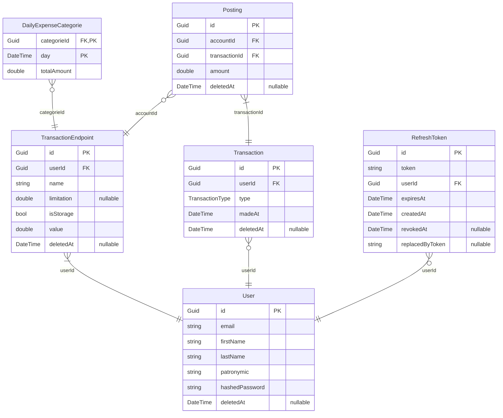

```mermaid
erDiagram
    DailyExpenseCategorie }o--|| TransactionEndpoint : categorieId
    DailyExpenseCategorie {
        Guid categorieId FK,PK
        DateTime day PK
        double totalAmount
    }

    TransactionEndpoint }|--|| User : userId
    TransactionEndpoint {
        Guid id PK
        Guid userId FK
        string name
        double limitation "nullable"
        bool isStorage
        double value
        DateTime deletedAt "nullable"
    }

    Transaction }o--|| User : userId
    Transaction {
        Guid id PK
        Guid userId FK
        TransactionType type
        DateTime madeAt
        DateTime deletedAt "nullable"
    }

    Posting }o--|| TransactionEndpoint : accountId
    Posting }|--|| Transaction : transactionId
    Posting {
        Guid id PK
        Guid accountId FK
        Guid transactionId FK
        double amount
        DateTime deletedAt "nullable"
    }
  
    User {
        Guid id PK
        string email
        string firstName
        string lastName
        string patronymic
        string hashedPassword
        DateTime deletedAt "nullable"
    }

    RefreshToken }o--|| User : userId
    RefreshToken {
        Guid id PK
        string token
        Guid userId FK
        DateTime expiresAt
        DateTime createdAt
        DateTime revokedAt "nullable"
        string replacedByToken "nullable"
    }
```